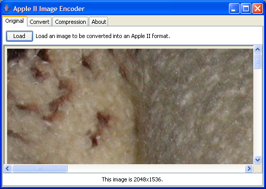
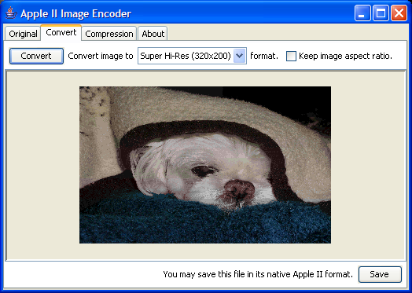
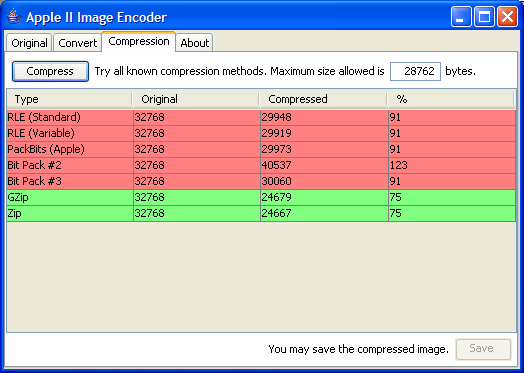

# Overview

This application will convert a modern image into a format usable by an Apple II - lores, double lores, and super hires are currently supported. It also includes basic compression capabilities. The color palettes go through an optimization phase to the standard 16 color palette, or, of the existing palette in the case of a super hires. 

**Requires:** Java 1.8 (originally implemented for Java 1.4, but being rebuilt with modern tools, hence Java 1.8 requirement). 

**Tip:** You can drag an image into the original tab instead of digging around for it. 

Currently supported Apple II graphic formats: 

Format | Width | Height | Colors
------ | ----- | ------ | ------ 
Lores | 40 | 40 | Standard Apple 16 colors 
Double | Lores | 80 | 40 | Standard Apple 16 colors 
Super Hires | 320 | 200 | 16 palettes of 16 colors; each palette entry is 12 bit color (4 bits per red, green, blue). 

Currently supported "compression" formats: RLE, Variable RLE, PackBits, 'deflate' method of Zip, GZip, BitPack #1 - #3 (my attempts and they're worthless).

The [original TODO list](TODO.md) has been preserved for any future efforts.

# Screen Shots

This is the original tab with a 2048x1536 image taken on my digital camera. If you're not sure what you are looking at, it is the upper-left corner of the image in the next picture. 

Choose the image type to convert to and click the convert button. If you wish, you can save the raw Apple II data. Note that for lores and double lores, no screen holes are saved. 

If you want some ideas about compressability, click the compression tab. You can enter the "max size allowed" which I use to figure out if the image can fit into the memory I've allocated for it on the Apple II. Click the Compress button to run through all the possibilities. Those that fit in the size given are colored green, the rest are red. If the compression method fails for some reason, it does not show up (note that Bit Pack #1 is missing - it only works on images less than 64 pixels wide or high or something like that). Note that each compression method's results can be saved to disk. 

# Installation

Apple Image Encoder is distributed in a self-executing Java JAR file. What this means is that once Java has been installed on your system, you just need to (a) click the link and open the program to run it or (b) save the file to your hard disk and then double-click on that file. Use whichever works best for you.

# Version History

* 09/12/2016 - 4.4.0 - Migrated to GitHub, Maven, rebuilt application.
* 08/06/2005 - 4.3.1 - Initial public release. Prior (internal) releases include command-line only, proof-of-concept work, etc. *This is the only version that will still work with Java 1.5 or later.  This is the original package from 2005.
